-   <a href="#statistical-analysis-plan"
    id="toc-statistical-analysis-plan">Statistical Analysis Plan</a>
-   <a href="#results-of-primary-analysis"
    id="toc-results-of-primary-analysis">Results of Primary Analysis</a>
-   <a href="#results-of-exploratory-path-analysis"
    id="toc-results-of-exploratory-path-analysis">Results of Exploratory
    Path Analysis</a>
-   <a href="#hypothesis-i" id="toc-hypothesis-i">Hypothesis I</a>
    -   <a href="#step-i-stigma-and-demographicclinical-variables"
        id="toc-step-i-stigma-and-demographicclinical-variables">Step I: Stigma
        and demographic/clinical variables</a>
        -   <a href="#model-setup" id="toc-model-setup">Model Setup</a>
        -   <a href="#diagnostics" id="toc-diagnostics">Diagnostics</a>
        -   <a href="#reduced-model-setup" id="toc-reduced-model-setup">Reduced
            Model Setup</a>
        -   <a href="#diagnostics-1" id="toc-diagnostics-1">Diagnostics</a>
        -   <a href="#fit-statistics" id="toc-fit-statistics">Fit Statistics</a>
    -   <a href="#step-ii-explaining-stigma-with-pain-beliefs"
        id="toc-step-ii-explaining-stigma-with-pain-beliefs">Step II: Explaining
        stigma with pain beliefs, …</a>
        -   <a href="#model-setup-1" id="toc-model-setup-1">Model Setup</a>
        -   <a href="#diagnostics-2" id="toc-diagnostics-2">Diagnostics</a>
        -   <a href="#model-summary" id="toc-model-summary">Model Summary</a>
    -   <a href="#hypothesis-tests" id="toc-hypothesis-tests">Hypothesis
        Tests</a>
-   <a href="#hypothesis-ii" id="toc-hypothesis-ii">Hypothesis II</a>
    -   <a href="#pain-intensity" id="toc-pain-intensity">Pain Intensity</a>
        -   <a href="#step-i-pain-intensity-and-demographicclinical-variables"
            id="toc-step-i-pain-intensity-and-demographicclinical-variables">Step I:
            Pain intensity and demographic/clinical variables</a>
            -   <a href="#model-setup-2" id="toc-model-setup-2">Model Setup</a>
            -   <a href="#diagnostics-3" id="toc-diagnostics-3">Diagnostics</a>
            -   <a href="#fit-statistics-1" id="toc-fit-statistics-1">Fit Statistics</a>
        -   <a href="#step-ii-explaining-pain-intensity-with-stigma"
            id="toc-step-ii-explaining-pain-intensity-with-stigma">Step II:
            Explaining pain intensity with stigma</a>
            -   <a href="#model-setup-3" id="toc-model-setup-3">Model Setup</a>
            -   <a href="#diagnostics-4" id="toc-diagnostics-4">Diagnostics</a>
            -   <a href="#model-summary-1" id="toc-model-summary-1">Model Summary</a>
        -   <a href="#hypothesis-tests-1" id="toc-hypothesis-tests-1">Hypothesis
            Tests</a>
    -   <a href="#disability" id="toc-disability">Disability</a>
        -   <a href="#step-i-disability-and-demographicclinical-variables"
            id="toc-step-i-disability-and-demographicclinical-variables">Step I:
            Disability and demographic/clinical variables</a>
            -   <a href="#model-setup-4" id="toc-model-setup-4">Model Setup</a>
            -   <a href="#diagnostics-5" id="toc-diagnostics-5">Diagnostics</a>
            -   <a href="#fit-statistics-2" id="toc-fit-statistics-2">Fit Statistics</a>
        -   <a href="#step-ii-explaining-disability-with-stigma"
            id="toc-step-ii-explaining-disability-with-stigma">Step II: Explaining
            disability with stigma</a>
            -   <a href="#model-setup-5" id="toc-model-setup-5">Model Setup</a>
            -   <a href="#diagnostics-6" id="toc-diagnostics-6">Diagnostics</a>
            -   <a href="#model-summary-2" id="toc-model-summary-2">Model Summary</a>
        -   <a href="#hypothesis-tests-2" id="toc-hypothesis-tests-2">Hypothesis
            Tests</a>
    -   <a href="#depression" id="toc-depression">Depression</a>
        -   <a href="#step-i-depression-and-demographicclinical-variables"
            id="toc-step-i-depression-and-demographicclinical-variables">Step I:
            Depression and demographic/clinical variables</a>
            -   <a href="#model-setup-6" id="toc-model-setup-6">Model Setup</a>
            -   <a href="#diagnostics-7" id="toc-diagnostics-7">Diagnostics</a>
            -   <a href="#fit-statistics-3" id="toc-fit-statistics-3">Fit Statistics</a>
        -   <a href="#step-ii-explaining-depression-with-stigma"
            id="toc-step-ii-explaining-depression-with-stigma">Step II: Explaining
            depression with stigma</a>
            -   <a href="#model-setup-7" id="toc-model-setup-7">Model Setup</a>
            -   <a href="#diagnostics-8" id="toc-diagnostics-8">Diagnostics</a>
            -   <a href="#model-summary-3" id="toc-model-summary-3">Model Summary</a>
        -   <a href="#hypothesis-tests-3" id="toc-hypothesis-tests-3">Hypothesis
            Tests</a>
    -   <a href="#support" id="toc-support">Support</a>
        -   <a href="#step-i-support-and-demographicclinical-variables"
            id="toc-step-i-support-and-demographicclinical-variables">Step I:
            Support and demographic/clinical variables</a>
            -   <a href="#model-setup-8" id="toc-model-setup-8">Model Setup</a>
            -   <a href="#diagnostics-9" id="toc-diagnostics-9">Diagnostics</a>
            -   <a href="#fit-statistics-4" id="toc-fit-statistics-4">Fit Statistics</a>
        -   <a href="#step-ii-explaining-support-with-stigma"
            id="toc-step-ii-explaining-support-with-stigma">Step II: Explaining
            support with stigma</a>
            -   <a href="#model-setup-9" id="toc-model-setup-9">Model Setup</a>
            -   <a href="#diagnostics-10" id="toc-diagnostics-10">Diagnostics</a>
            -   <a href="#model-summary-4" id="toc-model-summary-4">Model Summary</a>
        -   <a href="#hypothesis-tests-4" id="toc-hypothesis-tests-4">Hypothesis
            Tests</a>
-   <a href="#exploratory-path-analysis"
    id="toc-exploratory-path-analysis">Exploratory Path Analysis</a>
    -   <a href="#model-setup-10" id="toc-model-setup-10">Model Setup</a>
    -   <a href="#model-diagram" id="toc-model-diagram">Model Diagram</a>
    -   <a href="#model-summary-5" id="toc-model-summary-5">Model Summary</a>
-   <a href="#references" id="toc-references">References</a>

# Statistical Analysis Plan

A statistical analysis consisting of hierarchical linear regressions is
conducted to evaluate the following hypotheses:

1.  People with chronic pain such as those who have a co-morbid mental
    health diagnosis, who use opiates, and who have more medical
    (“organic”) beliefs about pain, experience greater stigma.

2.  People with higher stigma have higher pain levels, greater
    disability, depression, and less social support compared to those
    reporting less stigma.

For each hypothesis, the analysis is conducted in two steps. In the
first step, a linear regression model is constructed which includes all
the available demographic and clinical variables. The health of this
model is evaluated. If the model assumptions are violated, necessary
adjustments are made. In the second step, the variables of interest are
also added to the model. The health of the model is re-evaluated and
hypothesis tests are conducted. For hypothesis 1, the step 1 independent
variables are Age, Gender, Ethnicity, Relationship, Employment,
Diagnosis, Pain location and Pain duration. For step 2, additional
independent variables are: Organic beliefs, Psychological beliefs, Daily
opioid intake and History of mental health. All these variables are
discrete except Age, Pain duration, Daily opioid intake, Organic beliefs
and Psychological beliefs. The dependent continuous variable is stigma.
For hypothesis 2, four linear regression models are constructed
corresponding to the four clinical outcomes: Pain intensity, Disability,
Depression and Social support. All these variables are continuous. For
each outcome, step I independent variables are: Age, Gender, Ethnicity,
Relationship, Employment, Diagnosis, Pain location and Pain duration,
Organic beliefs, Psychological beliefs, Daily opioid intake and History
of mental health. For each outcome, the remaining outcomes are also
included as independent variables so that the interdependence across the
outcomes is accounted for. At step 2, Stigma is also added as an
independent variable.

The two step hierarchical linear regression allows estimation of the
amount of variance explained (*R*<sub>*a**d**j*</sub><sup>2</sup>;
r-squared adjusted) by all the predictors and the additional variance
explained (*Δ**R*<sub>*a**d**j*</sub><sup>2</sup>) by the variables of
interest. To test whether a specific independent variable explains
significant amount of dependent variable variance, a type II analysis of
variance (ANOVA) F-test is used. This test considers the variance
explained by a specific independent variable by comparing a linear
regression model with the specific variable to the model which does not
have the specific variable. Both models have all the other step 2
independent variables. Therefore, this test accounts for the variance
explained by the correlated independent variables. Statistical
significance level is set at 0.05. The health of the regression models
is checked by evaluating the normality/homogeneity of variance
assumptions for the residuals using histogram, QQ-plot and fitted versus
residuals plot. Moreover, multicollinearity is checked with the variance
inflation factor which is considered unacceptable if greater than 10
(McElreath, 2018). Quadratic-root transformation is applied to Daily
opioid intake and Pain duration as the original variables are not
normally distributed.

An exploratory path analysis is also conducted with the aim of collating
the inferences drawn from the hypothesis tests into a single
parsimonious model. This model is constructed using structural equation
modeling. Variables which have significant associations in the above
described linear regressions are included in this model. Moreover, any
variables which resulted in better fit statistics were also included.
Various plausible directions of relationships amongst the variables are
also explored while monitoring the health of the model. The health of
the model is evaluated against suggested thresholds for CFI (\> 0.9),
TLI (\> 0.9) and RMSEA (\< 0.08) statistics (Van de Schoot, Lugtig, &
Hox, 2012).

All the analyses are conducted in R using packages: car, dplyr, lavaan,
ggplot2, semPlot and report (Epskamp, 2019; Fox & Weisberg, 2019;
Makowski, Ben-Shachar, Patil, & Lüdecke, 2021; R Core Team, 2021;
Rosseel, 2012; Wickham, 2016; Wickham, François, Henry, & Müller, 2021).

# Results of Primary Analysis

For Stigma, demographic and clinical variables explain 10% of the
variance. Organic beliefs, Psychological beliefs, Use of strong opiates
and History of Mental health together explain an additional 14% of the
Stigma variance. When considered individually, Organic beliefs (F(1,
184) = 10.84, p = 0.001), Mental health (F(1, 184) = 14.5, p = 0.0002),
Daily opioid intake (F(1, 184) = 6.46, p = 0.01) and Employment (F(5,
184) = 2.45, p = 0.04) explain a significant portion of the variance.
The corresponding regression coefficients and their 95% confidence
intervals suggest that an increase in Organic beliefs predicts an
increase (0.018, 95% CI \[0.007, 0.029\]) in Stigma, not having a mental
health diagnosis predicts lower (-0.270, 95% CI \[-0.410, -0.130\])
levels of Stigma , an increase in opioid intake predicts an increase
(0.077, 95% CI \[0.017, 0.137\]) in Stigma, and being unemployed
predicts higher (0.272, 95% CI \[0.117, 0.427\]) levels of Stigma.

For Pain intensity, demographic and clinical variables together with
other outcomes (Disability, Depression and Social support) explain 41.5%
of the variance. Addition of stigma as a predictor does not explain any
additional variance in Pain intensity. Individually, Ethnicity (F(3,
180) = 3.09, p = 0.03) and Disability (F(1, 180) = 29.41, p = 1.869 x
10<sup>−7</sup>) explain significant variance. Model coefficients
suggest higher levels of pain intensity for people of Pacific ethnicity
(1.88, 95% CI \[0.55, 3.21\]) and an increase (0.37, 95% CI \[0.24,
0.50\]) in pain intensity with an increase in Disability.

For Disability, demographic and clinical variables together with other
outcomes (Pain intensity, Depression and Social support) explain 59% of
the variance. Stigma explains an additional 3.2% of the variance in
Disability. Individually, Relationship (F(4, 180) = 4.8, p = 0.001),
Employment (F(5, 180) = 2.4, p = 0.04), Pain location (F(8, 180) = 2.3,
p = 0.03), Organic beliefs (F(1, 180) = 4.4, p = 0.04), Daily opioid
intake (F(1, 180) = 4.33, p = 0.04), Pain intensity (F(1, 180) = 29.41,
p = 1.869 x 10<sup>−7</sup>), Depression (F(1, 180) = 18.64, p = 2.604 x
10<sup>−5</sup>) and Stigma (F(1, 180) = 16.31, p = 7.94 x
10<sup>−5</sup>) explain significant variance in Disability. Model
coefficients suggest lower (-0.516, 95% CI \[-1.017, -0.015\]) levels of
Disability for people who are married or in a de facto relationship,
higher levels of Disability (1.24, 95% CI \[0.15, 2.33\]) for people
with “Other” employment status, lower levels of Disability for people
with pain in Neck/back (-0.8, 95% CI \[-1.53, -0.07\]) or Abdomen/pelvis
(-0.846, 95% CI \[-1.63, -0.06\]), an increase (0.04, 95% CI \[0.002,
0.07\]) in Disability with an increase in Organic beliefs, an increase
(0.19, 95% CI \[0.01, 0.37\]) in Disability with an increase in Daily
opioid intake, an increase (0.38, 95% CI \[0.24, 0.52\]) in Disability
with an increase in Pain intensity, an increase (0.09, 95% CI \[0.05,
0.12\]) in Disability with increase in Depression, and an increase
(1.05, 95% CI \[0.54, 1.56\]) in Disability with an increase in Stigma.

For Depression, demographic and clinical variables together with other
outcomes (Pain intensity, Disability and Social support) explain 48.7%
of the variance. Stigma explains an additional 4.4% of the variance.
Individually, Mental health (F(1, 180) = 6.2, p = 0.01), Disability
(F(1, 180) = 18.64, p = 2.604 x 10<sup>−5</sup>) and Stigma (F(1, 180) =
17.74, p = 3.999 x 10<sup>−5</sup>) explain significant variance in
Depression. Model coefficients suggest lower levels of Depression
(-1.98, 95% CI \[-3.55, -0.41\]) for people who do not have a mental
health diagnosis, an increase in Depression (1.1, 95% CI \[0.6, 1.61\])
with an increase in Disability and an increase in Depression (3.92, 95%
CI \[2.08, 5.75\]) with an increase in Stigma.

For Social support, demographic and clinical variables together with
other outcomes (Pain intensity, Disability and Depression) explain 11%
of the variance. Stigma explains an additional 6.1% of the variance.
Individually, only Stigma (F(1, 180) = 14.29, p = 0.0002) explain
significant variance in Social support. Model coefficients suggest a
decrease in social support (-1.77, 95% CI \[-2.7, -0.85\]) with an
increase in Stigma.

# Results of Exploratory Path Analysis

The exploratory path analysis suggests higher levels of Stigma
associated with higher opioid intake, having more Organic pain beliefs,
having a mental health history and being unemployed. Higher Stigma
itself predicts higher Disability and Depression but lower Social
support. Pain intensity is not predicted by any variable in the data.
Rather it is a strong predictor of Disability. Higher Pain intensity
predicts higher Disability. Higher Disability itself predicts higher
Depression.

Being married or having a de facto relationship predicts lower levels of
Disability, having more organic beliefs predicts higher Disability and
having neck/back/abdomen/pelvis pain predicts lower Disability compared
to upper limb/chest/hips/lower limb/widespread pain. Having a mental
health history predicts higher Depression. Some of the relationships
which stand out in the hierarchical linear regression analysis are
removed from the model as their presence results in poor model fit
statistics. Changing the presented direction of relationship amongst the
variables also results in poor fit statistics. The fit statistics for
the presented model are CFI = 0.95, TLI = 0.93 and RMSEA = 0.067 90% CI
\[0.036, 0.097\].

These results are illustrated in the following figure where the
direction and width of the arrows represent the direction and strength
of relationship between the variables. Red arrows represent a decrease
in the consequent variable with an increase in the antecedent variable.
Green arrows represent an increase in the consequent variable with an
increase in the antecedent variable.

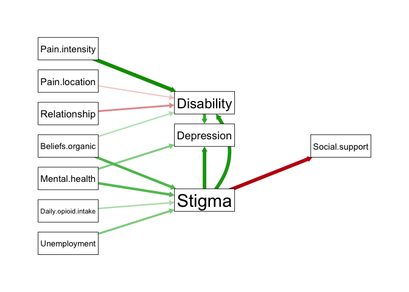<!-- -->

# Hypothesis I

## Step I: Stigma and demographic/clinical variables

### Model Setup

``` r
Model.stageI.stepI <- lm(Stigma.total ~ Age + Gender + Ethnicity +
                           Relationship + Employment +
                           Diagnosis + Pain.loc + Pain.duration,
                         data = Datasource)
```

### Diagnostics

Residuals plot.

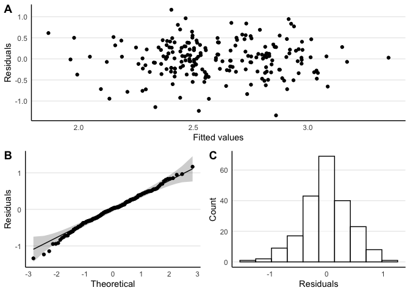<!-- -->

Multicollinearity statistics.

| Term          |       VIF | VIF_CI_high | SE_factor | Tolerance | Tolerance_CI_low | Tolerance_CI_high | Label        |
|:--------------|----------:|------------:|----------:|----------:|-----------------:|------------------:|:-------------|
| Age           |  2.573878 |    3.100753 |  1.604331 | 0.3885188 |        0.3225023 |         0.4588955 | Low (\< 5)   |
| Gender        |  1.414058 |    1.671667 |  1.189142 | 0.7071844 |        0.5982051 |         0.7966530 | Low (\< 5)   |
| Ethnicity     |  1.608568 |    1.907132 |  1.268293 | 0.6216710 |        0.5243477 |         0.7100909 | Low (\< 5)   |
| Relationship  |  3.773982 |    4.592752 |  1.942674 | 0.2649721 |        0.2177344 |         0.3182884 | Low (\< 5)   |
| Employment    |  3.249806 |    3.940799 |  1.802722 | 0.3077107 |        0.2537556 |         0.3674885 | Low (\< 5)   |
| Diagnosis     | 11.405325 |   14.091773 |  3.377177 | 0.0876783 |        0.0709634 |         0.1078733 | High (\> 10) |
| Pain.loc      |  7.984997 |    9.833816 |  2.825774 | 0.1252349 |        0.1016899 |         0.1533010 | Moderate     |
| Pain.duration |  1.337317 |    1.581134 |  1.156424 | 0.7477660 |        0.6324574 |         0.8362644 | Low (\< 5)   |

High and moderate variance inflation factor is indicated for Diagnosis
and Pain location, respectively. Plotting these factors against each
other reveals the underlying clustering of participants across them. If
pain locations(s) is known, one can predict the Diagnosis thus
eliminating the need for inclusion of Diagnosis in the model.

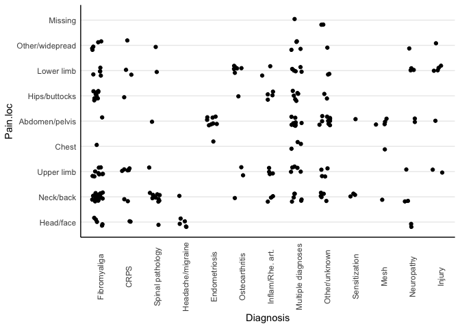<!-- -->

### Reduced Model Setup

``` r
Model.stageI.stepI <- lm(Stigma.total ~ Age + Gender + Ethnicity +
                           Relationship + Employment +
                           Pain.loc + Pain.duration,
                         data = Datasource)
```

### Diagnostics

Residuals plot.

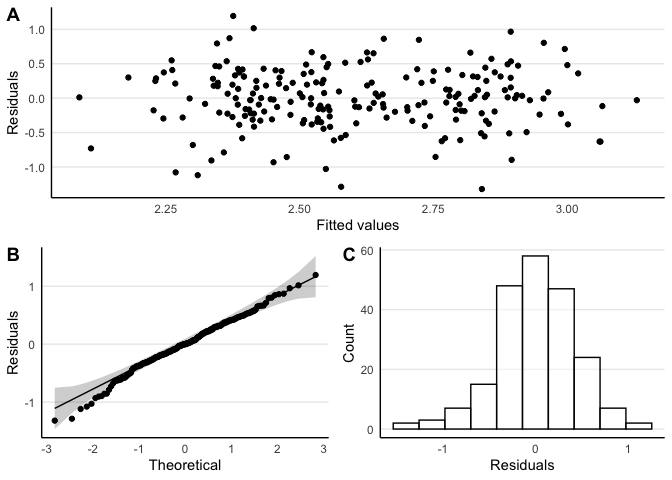<!-- -->

Multicollinearity statistics.

| Term          |      VIF | VIF_CI_high | SE_factor | Tolerance | Tolerance_CI_low | Tolerance_CI_high | Label     |
|:--------------|---------:|------------:|----------:|----------:|-----------------:|------------------:|:----------|
| Age           | 2.308445 |    2.808475 |  1.519357 | 0.4331920 |        0.3560652 |         0.5136977 | Low (\<5) |
| Gender        | 1.244953 |    1.499299 |  1.115775 | 0.8032429 |        0.6669783 |         0.8927194 | Low (\<5) |
| Ethnicity     | 1.353792 |    1.622538 |  1.163526 | 0.7386660 |        0.6163184 |         0.8325966 | Low (\<5) |
| Relationship  | 2.730012 |    3.339572 |  1.652275 | 0.3662987 |        0.2994396 |         0.4387371 | Low (\<5) |
| Employment    | 2.396827 |    2.919732 |  1.548169 | 0.4172183 |        0.3424972 |         0.4959449 | Low (\<5) |
| Pain.loc      | 2.123456 |    2.575839 |  1.457208 | 0.4709304 |        0.3882230 |         0.5552654 | Low (\<5) |
| Pain.duration | 1.188891 |    1.443709 |  1.090363 | 0.8411202 |        0.6926605 |         0.9255725 | Low (\<5) |

### Fit Statistics

| Parameter |   Fit |
|:----------|------:|
|           |       |
| R2        | 0.210 |
| R2 (adj.) | 0.109 |
| Sigma     | 0.457 |

## Step II: Explaining stigma with pain beliefs, …

### Model Setup

``` r
Model.stageI.stepII <- lm(Stigma.total ~ Age + Gender + Ethnicity +
                            Relationship + Employment +
                            Pain.loc + Pain.duration +
                            Beliefs.organic + Beliefs.psych +
                            Daily.opioid.intake + Mental.health,
                          data = Datasource)
```

### Diagnostics

Residuals plot.

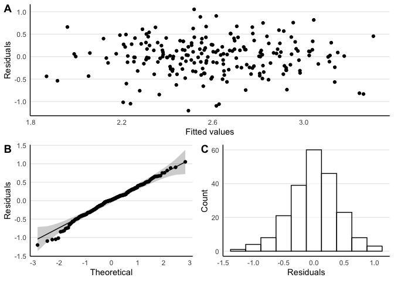<!-- -->

Multicollinearity statistics.

| Term                |      VIF | VIF_CI_high | SE_factor | Tolerance | Tolerance_CI_low | Tolerance_CI_high | Label      |
|:--------------------|---------:|------------:|----------:|----------:|-----------------:|------------------:|:-----------|
| Age                 | 2.411769 |    2.925443 |  1.552987 | 0.4146333 |        0.3418285 |         0.4913680 | Low (\< 5) |
| Gender              | 1.371882 |    1.636403 |  1.171274 | 0.7289256 |        0.6110966 |         0.8214838 | Low (\< 5) |
| Ethnicity           | 1.461648 |    1.744080 |  1.208986 | 0.6841591 |        0.5733682 |         0.7773513 | Low (\< 5) |
| Relationship        | 3.084261 |    3.769151 |  1.756206 | 0.3242268 |        0.2653117 |         0.3892924 | Low (\< 5) |
| Employment          | 3.011249 |    3.677485 |  1.735295 | 0.3320882 |        0.2719250 |         0.3982808 | Low (\< 5) |
| Pain.loc            | 2.516393 |    3.056587 |  1.586314 | 0.3973941 |        0.3271623 |         0.4721235 | Low (\< 5) |
| Pain.duration       | 1.206908 |    1.452681 |  1.098594 | 0.8285635 |        0.6883826 |         0.9135990 | Low (\< 5) |
| Beliefs.organic     | 1.328054 |    1.584990 |  1.152412 | 0.7529816 |        0.6309189 |         0.8446176 | Low (\< 5) |
| Beliefs.psych       | 1.158984 |    1.411020 |  1.076561 | 0.8628244 |        0.7087074 |         0.9420667 | Low (\< 5) |
| Daily.opioid.intake | 1.268841 |    1.517734 |  1.126428 | 0.7881211 |        0.6588769 |         0.8775015 | Low (\< 5) |
| Mental.health       | 1.225183 |    1.471013 |  1.106880 | 0.8162044 |        0.6798037 |         0.9028071 | Low (\< 5) |

### Model Summary

| Parameter                         | Coefficient | CI (low) | CI (high) | Std. Coefficient |   Fit |
|:----------------------------------|------------:|---------:|----------:|-----------------:|------:|
| (Intercept)                       |       2.191 |    1.578 |     2.805 |            0.444 |       |
| Age                               |      -0.003 |   -0.009 |     0.004 |           -0.081 |       |
| Gender \[Female\]                 |      -0.146 |   -0.380 |     0.087 |           -0.303 |       |
| Gender \[Other\]                  |       0.098 |   -0.558 |     0.753 |            0.202 |       |
| Ethnicity \[Māori\]               |       0.028 |   -0.192 |     0.248 |            0.058 |       |
| Ethnicity \[Pacific\]             |       0.432 |   -0.018 |     0.882 |            0.893 |       |
| Ethnicity \[Asian\]               |       0.411 |   -0.030 |     0.852 |            0.849 |       |
| Relationship \[In a relation\]    |      -0.177 |   -0.388 |     0.034 |           -0.366 |       |
| Relationship \[Married/De facto\] |      -0.077 |   -0.248 |     0.095 |           -0.159 |       |
| Relationship \[Divorced/sep.\]    |      -0.146 |   -0.397 |     0.105 |           -0.302 |       |
| Relationship \[Widowed\]          |       0.020 |   -0.450 |     0.489 |            0.041 |       |
| Employment \[Unemployed/benefit\] |       0.272 |    0.117 |     0.427 |            0.563 |       |
| Employment \[Work at home\]       |       0.074 |   -0.213 |     0.360 |            0.153 |       |
| Employment \[Retired\]            |       0.087 |   -0.203 |     0.377 |            0.180 |       |
| Employment \[Student\]            |       0.072 |   -0.200 |     0.345 |            0.150 |       |
| Employment \[Other\]              |       0.071 |   -0.301 |     0.444 |            0.148 |       |
| Pain loc \[Neck/back\]            |      -0.066 |   -0.316 |     0.185 |           -0.136 |       |
| Pain loc \[Upper limb\]           |      -0.127 |   -0.396 |     0.143 |           -0.262 |       |
| Pain loc \[Chest\]                |      -0.187 |   -0.625 |     0.251 |           -0.387 |       |
| Pain loc \[Abdomen/pelvis\]       |       0.011 |   -0.257 |     0.280 |            0.024 |       |
| Pain loc \[Hips/buttocks\]        |       0.048 |   -0.238 |     0.334 |            0.099 |       |
| Pain loc \[Lower limb\]           |      -0.069 |   -0.344 |     0.206 |           -0.142 |       |
| Pain loc \[Other/widepread\]      |      -0.056 |   -0.378 |     0.265 |           -0.117 |       |
| Pain loc \[Missing\]              |       0.271 |   -0.285 |     0.827 |            0.560 |       |
| Pain duration                     |      -0.024 |   -0.113 |     0.064 |           -0.036 |       |
| Beliefs organic                   |       0.018 |    0.007 |     0.029 |            0.227 |       |
| Beliefs psych                     |       0.014 |   -0.002 |     0.030 |            0.113 |       |
| Daily opioid intake               |       0.077 |    0.017 |     0.137 |            0.171 |       |
| Mental health \[No diagnosis\]    |      -0.270 |   -0.410 |    -0.130 |           -0.559 |       |
|                                   |             |          |           |                  |       |
| R2                                |             |          |           |                  | 0.342 |
| R2 (adj.)                         |             |          |           |                  | 0.242 |
| Sigma                             |             |          |           |                  | 0.421 |

## Hypothesis Tests

    Anova Table (Type II tests)

    Response: Stigma.total
                        Sum Sq  Df F value    Pr(>F)    
    Age                  0.134   1  0.7575 0.3852411    
    Gender               0.363   2  1.0235 0.3613587    
    Ethnicity            1.217   3  2.2876 0.0800890 .  
    Relationship         0.632   4  0.8909 0.4705062    
    Employment           2.168   5  2.4450 0.0357358 *  
    Pain.loc             0.828   8  0.5837 0.7905089    
    Pain.duration        0.052   1  0.2927 0.5891808    
    Beliefs.organic      1.923   1 10.8427 0.0011894 ** 
    Beliefs.psych        0.550   1  3.1031 0.0798065 .  
    Daily.opioid.intake  1.146   1  6.4600 0.0118577 *  
    Mental.health        2.571   1 14.4948 0.0001913 ***
    Residuals           32.634 184                      
    ---
    Signif. codes:  0 '***' 0.001 '**' 0.01 '*' 0.05 '.' 0.1 ' ' 1

# Hypothesis II

## Pain Intensity

### Step I: Pain intensity and demographic/clinical variables

#### Model Setup

``` r
Model.stageII.pain.stepI <- lm(Pain.intensity ~ Age + Gender + Ethnicity +
                                 Relationship + Employment +
                                 Pain.loc + Pain.duration +
                                 Beliefs.organic + Beliefs.psych +
                                 Daily.opioid.intake + Mental.health +
                                 Disability + Depression.phq9 + Support.oss3,
                               data = Datasource)
```

#### Diagnostics

Residuals plot.

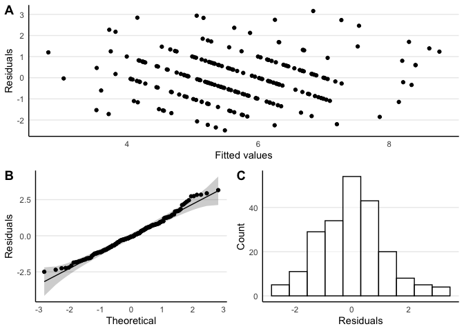<!-- -->

Multicollinearity statistics.

| Term                |      VIF | VIF_CI_high | SE_factor | Tolerance | Tolerance_CI_low | Tolerance_CI_high | Label      |
|:--------------------|---------:|------------:|----------:|----------:|-----------------:|------------------:|:-----------|
| Age                 | 2.489637 |    3.012918 |  1.577859 | 0.4016649 |        0.3319042 |         0.4756492 | Low (\< 5) |
| Gender              | 1.401272 |    1.665734 |  1.183753 | 0.7136376 |        0.6003361 |         0.8052394 | Low (\< 5) |
| Ethnicity           | 1.623599 |    1.936011 |  1.274205 | 0.6159157 |        0.5165258 |         0.7064840 | Low (\< 5) |
| Relationship        | 3.372716 |    4.117185 |  1.836496 | 0.2964970 |        0.2428844 |         0.3563733 | Low (\< 5) |
| Employment          | 3.492912 |    4.267603 |  1.868933 | 0.2862941 |        0.2343236 |         0.3446034 | Low (\< 5) |
| Pain.loc            | 3.019683 |    3.675505 |  1.737723 | 0.3311606 |        0.2720714 |         0.3960997 | Low (\< 5) |
| Pain.duration       | 1.235755 |    1.476384 |  1.111645 | 0.8092218 |        0.6773306 |         0.8955184 | Low (\< 5) |
| Beliefs.organic     | 1.464366 |    1.741567 |  1.210110 | 0.6828891 |        0.5741957 |         0.7747225 | Low (\< 5) |
| Beliefs.psych       | 1.191811 |    1.432446 |  1.091701 | 0.8390593 |        0.6981064 |         0.9215932 | Low (\< 5) |
| Daily.opioid.intake | 1.342393 |    1.596159 |  1.158617 | 0.7449384 |        0.6265042 |         0.8356682 | Low (\< 5) |
| Mental.health       | 1.436347 |    1.707766 |  1.198477 | 0.6962104 |        0.5855603 |         0.7880133 | Low (\< 5) |
| Disability          | 2.453480 |    2.967758 |  1.566359 | 0.4075844 |        0.3369546 |         0.4822510 | Low (\< 5) |
| Depression.phq9     | 2.264017 |    2.731263 |  1.504665 | 0.4416929 |        0.3661310 |         0.5200548 | Low (\< 5) |
| Support.oss3        | 1.316873 |    1.566545 |  1.147551 | 0.7593749 |        0.6383474 |         0.8494523 | Low (\< 5) |

#### Fit Statistics

|     | Parameter |   Fit |
|:----|:----------|------:|
| 33  |           |       |
| 34  | R2        | 0.501 |
| 35  | R2 (adj.) | 0.415 |
| 36  | Sigma     | 1.202 |

### Step II: Explaining pain intensity with stigma

#### Model Setup

``` r
Model.stageII.pain.stepII <- lm(Pain.intensity ~ Age + Gender + Ethnicity +
                                  Relationship + Employment +
                                  Pain.loc + Pain.duration +
                                  Beliefs.organic + Beliefs.psych +
                                  Daily.opioid.intake + Mental.health +
                                  Disability + Depression.phq9 + Support.oss3 +
                                  Stigma.total,
                                data = Datasource)
```

#### Diagnostics

Residuals plot.

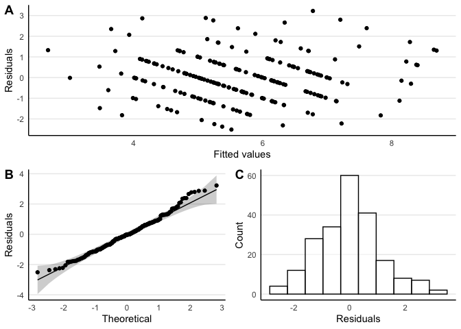<!-- -->

Multicollinearity statistics.

| Term                |      VIF | VIF_CI_high | SE_factor | Tolerance | Tolerance_CI_low | Tolerance_CI_high | Label      |
|:--------------------|---------:|------------:|----------:|----------:|-----------------:|------------------:|:-----------|
| Age                 | 2.498308 |    3.020370 |  1.580604 | 0.4002710 |        0.3310852 |         0.4736765 | Low (\< 5) |
| Gender              | 1.415544 |    1.680913 |  1.189766 | 0.7064422 |        0.5949148 |         0.7977052 | Low (\< 5) |
| Ethnicity           | 1.652702 |    1.969686 |  1.285575 | 0.6050696 |        0.5076952 |         0.6947635 | Low (\< 5) |
| Relationship        | 3.539066 |    4.320385 |  1.881241 | 0.2825604 |        0.2314608 |         0.3399512 | Low (\< 5) |
| Employment          | 3.599777 |    4.396275 |  1.897308 | 0.2777950 |        0.2274653 |         0.3344399 | Low (\< 5) |
| Pain.loc            | 3.128161 |    3.806856 |  1.768661 | 0.3196767 |        0.2626840 |         0.3826179 | Low (\< 5) |
| Pain.duration       | 1.238331 |    1.477252 |  1.112803 | 0.8075388 |        0.6769327 |         0.8936408 | Low (\< 5) |
| Beliefs.organic     | 1.478936 |    1.757267 |  1.216115 | 0.6761617 |        0.5690655 |         0.7675157 | Low (\< 5) |
| Beliefs.psych       | 1.205612 |    1.443725 |  1.098004 | 0.8294542 |        0.6926528 |         0.9130119 | Low (\< 5) |
| Daily.opioid.intake | 1.360458 |    1.615502 |  1.166387 | 0.7350465 |        0.6190027 |         0.8256983 | Low (\< 5) |
| Mental.health       | 1.440556 |    1.710929 |  1.200232 | 0.6941762 |        0.5844778 |         0.7855404 | Low (\< 5) |
| Disability          | 2.678109 |    3.244759 |  1.636493 | 0.3733978 |        0.3081893 |         0.4435572 | Low (\< 5) |
| Depression.phq9     | 2.481287 |    2.999137 |  1.575210 | 0.4030166 |        0.3334293 |         0.4767400 | Low (\< 5) |
| Support.oss3        | 1.420714 |    1.687103 |  1.191937 | 0.7038715 |        0.5927319 |         0.7951633 | Low (\< 5) |
| Stigma.total        | 2.416042 |    2.917757 |  1.554362 | 0.4139000 |        0.3427291 |         0.4888579 | Low (\< 5) |

#### Model Summary

| Parameter                         | Coefficient | CI (low) | CI (high) | Std. Coefficient |   Fit |
|:----------------------------------|------------:|---------:|----------:|-----------------:|------:|
| (Intercept)                       |       1.979 |   -0.308 |     4.267 |           -0.148 |       |
| Age                               |       0.015 |   -0.003 |     0.034 |            0.136 |       |
| Gender \[Female\]                 |      -0.009 |   -0.681 |     0.663 |           -0.006 |       |
| Gender \[Other\]                  |      -0.256 |   -2.139 |     1.626 |           -0.163 |       |
| Ethnicity \[Māori\]               |      -0.188 |   -0.825 |     0.450 |           -0.119 |       |
| Ethnicity \[Pacific\]             |       1.879 |    0.549 |     3.209 |            1.195 |       |
| Ethnicity \[Asian\]               |       0.662 |   -0.624 |     1.949 |            0.421 |       |
| Relationship \[In a relation\]    |       0.069 |   -0.545 |     0.683 |            0.044 |       |
| Relationship \[Married/De facto\] |       0.305 |   -0.191 |     0.801 |            0.194 |       |
| Relationship \[Divorced/sep.\]    |      -0.446 |   -1.170 |     0.278 |           -0.283 |       |
| Relationship \[Widowed\]          |       0.784 |   -0.572 |     2.139 |            0.498 |       |
| Employment \[Unemployed/benefit\] |       0.261 |   -0.205 |     0.727 |            0.166 |       |
| Employment \[Work at home\]       |      -0.535 |   -1.359 |     0.289 |           -0.340 |       |
| Employment \[Retired\]            |       0.347 |   -0.492 |     1.186 |            0.221 |       |
| Employment \[Student\]            |       0.539 |   -0.249 |     1.327 |            0.343 |       |
| Employment \[Other\]              |      -0.220 |   -1.303 |     0.863 |           -0.140 |       |
| Pain loc \[Neck/back\]            |       0.077 |   -0.653 |     0.806 |            0.049 |       |
| Pain loc \[Upper limb\]           |      -0.046 |   -0.825 |     0.734 |           -0.029 |       |
| Pain loc \[Chest\]                |       0.029 |   -1.239 |     1.297 |            0.019 |       |
| Pain loc \[Abdomen/pelvis\]       |       0.134 |   -0.648 |     0.915 |            0.085 |       |
| Pain loc \[Hips/buttocks\]        |      -0.366 |   -1.186 |     0.454 |           -0.233 |       |
| Pain loc \[Lower limb\]           |      -0.071 |   -0.873 |     0.730 |           -0.045 |       |
| Pain loc \[Other/widepread\]      |      -0.097 |   -1.023 |     0.829 |           -0.062 |       |
| Pain loc \[Missing\]              |       2.300 |    0.682 |     3.918 |            1.462 |       |
| Pain duration                     |       0.073 |   -0.184 |     0.330 |            0.033 |       |
| Beliefs organic                   |       0.024 |   -0.009 |     0.057 |            0.092 |       |
| Beliefs psych                     |      -0.044 |   -0.090 |     0.002 |           -0.108 |       |
| Daily opioid intake               |      -0.012 |   -0.189 |     0.164 |           -0.008 |       |
| Mental health \[No diagnosis\]    |      -0.155 |   -0.589 |     0.280 |           -0.098 |       |
| Disability                        |       0.369 |    0.235 |     0.503 |            0.467 |       |
| Depression phq9                   |       0.029 |   -0.011 |     0.069 |            0.118 |       |
| Support oss3                      |      -0.014 |   -0.094 |     0.067 |           -0.021 |       |
| Stigma total                      |      -0.192 |   -0.716 |     0.332 |           -0.059 |       |
|                                   |             |          |           |                  |       |
| R2                                |             |          |           |                  | 0.502 |
| R2 (adj.)                         |             |          |           |                  | 0.414 |
| Sigma                             |             |          |           |                  | 1.204 |

### Hypothesis Tests

    Anova Table (Type II tests)

    Response: Pain.intensity
                         Sum Sq  Df F value    Pr(>F)    
    Age                   3.896   1  2.6872   0.10290    
    Gender                0.109   2  0.0377   0.96305    
    Ethnicity            13.451   3  3.0927   0.02835 *  
    Relationship          9.542   4  1.6455   0.16477    
    Employment            8.066   5  1.1127   0.35523    
    Pain.loc             18.405   8  1.5869   0.13143    
    Pain.duration         0.458   1  0.3156   0.57494    
    Beliefs.organic       3.027   1  2.0879   0.15021    
    Beliefs.psych         5.112   1  3.5260   0.06203 .  
    Daily.opioid.intake   0.027   1  0.0187   0.89125    
    Mental.health         0.716   1  0.4940   0.48307    
    Disability           42.633   1 29.4077 1.869e-07 ***
    Depression.phq9       2.955   1  2.0381   0.15514    
    Support.oss3          0.162   1  0.1117   0.73860    
    Stigma.total          0.757   1  0.5220   0.47094    
    Residuals           260.950 180                      
    ---
    Signif. codes:  0 '***' 0.001 '**' 0.01 '*' 0.05 '.' 0.1 ' ' 1

## Disability

### Step I: Disability and demographic/clinical variables

#### Model Setup

``` r
Model.stageII.dis.stepI <- lm(Disability ~ Age + Gender + Ethnicity +
                                Relationship + Employment +
                                Pain.loc + Pain.duration +
                                Beliefs.organic + Beliefs.psych +
                                Daily.opioid.intake + Mental.health +
                                Pain.intensity + Depression.phq9 + Support.oss3,
                              data = Datasource)
```

#### Diagnostics

Residuals plot.

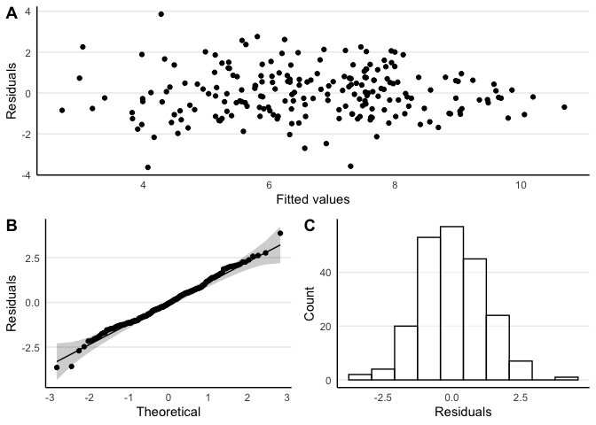<!-- -->

Multicollinearity statistics.

| Term                |      VIF | VIF_CI_high | SE_factor | Tolerance | Tolerance_CI_low | Tolerance_CI_high | Label      |
|:--------------------|---------:|------------:|----------:|----------:|-----------------:|------------------:|:-----------|
| Age                 | 2.508362 |    3.036307 |  1.583781 | 0.3986665 |        0.3293475 |         0.4723006 | Low (\< 5) |
| Gender              | 1.393612 |    1.656605 |  1.180513 | 0.7175599 |        0.6036443 |         0.8090898 | Low (\< 5) |
| Ethnicity           | 1.677143 |    2.001959 |  1.295046 | 0.5962520 |        0.4995107 |         0.6860470 | Low (\< 5) |
| Relationship        | 3.203525 |    3.905485 |  1.789839 | 0.3121562 |        0.2560501 |         0.3743696 | Low (\< 5) |
| Employment          | 3.420644 |    4.177162 |  1.849498 | 0.2923426 |        0.2393970 |         0.3515851 | Low (\< 5) |
| Pain.loc            | 2.967350 |    3.610050 |  1.722600 | 0.3370010 |        0.2770045 |         0.4027534 | Low (\< 5) |
| Pain.duration       | 1.237891 |    1.478641 |  1.112605 | 0.8078257 |        0.6762968 |         0.8942665 | Low (\< 5) |
| Beliefs.organic     | 1.424363 |    1.693367 |  1.193467 | 0.7020680 |        0.5905396 |         0.7938243 | Low (\< 5) |
| Beliefs.psych       | 1.215159 |    1.455123 |  1.102342 | 0.8229378 |        0.6872274 |         0.9076749 | Low (\< 5) |
| Daily.opioid.intake | 1.291236 |    1.537268 |  1.136326 | 0.7744520 |        0.6505046 |         0.8636553 | Low (\< 5) |
| Mental.health       | 1.418583 |    1.686435 |  1.191043 | 0.7049288 |        0.5929669 |         0.7966548 | Low (\< 5) |
| Pain.intensity      | 1.720562 |    2.055566 |  1.311702 | 0.5812054 |        0.4864839 |         0.6702962 | Low (\< 5) |
| Depression.phq9     | 1.862290 |    2.231127 |  1.364657 | 0.5369734 |        0.4482039 |         0.6234596 | Low (\< 5) |
| Support.oss3        | 1.295597 |    1.542210 |  1.138243 | 0.7718449 |        0.6484203 |         0.8612144 | Low (\< 5) |

#### Fit Statistics

|     | Parameter |   Fit |
|:----|:----------|------:|
| 33  |           |       |
| 34  | R2        | 0.650 |
| 35  | R2 (adj.) | 0.590 |
| 36  | Sigma     | 1.274 |

### Step II: Explaining disability with stigma

#### Model Setup

``` r
Model.stageII.dis.stepII <- lm(Disability ~ Age + Gender + Ethnicity +
                                 Relationship + Employment +
                                 Pain.loc + Pain.duration +
                                 Beliefs.organic + Beliefs.psych +
                                 Daily.opioid.intake + Mental.health +
                                 Pain.intensity + Depression.phq9 + Support.oss3 +
                                 Stigma.total,
                               data = Datasource)
```

#### Diagnostics

Residuals plot.

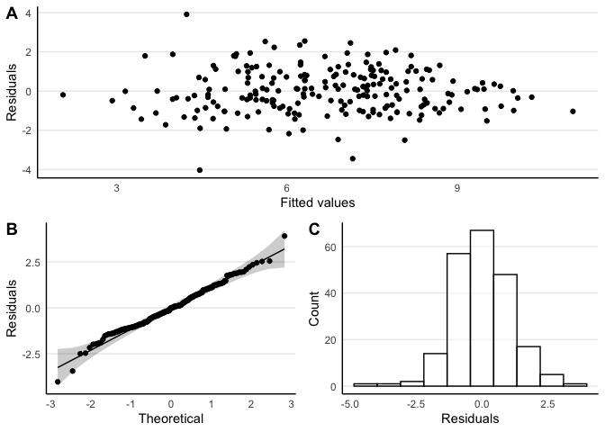<!-- -->

Multicollinearity statistics.

| Term                |      VIF | VIF_CI_high | SE_factor | Tolerance | Tolerance_CI_low | Tolerance_CI_high | Label      |
|:--------------------|---------:|------------:|----------:|----------:|-----------------:|------------------:|:-----------|
| Age                 | 2.509798 |    3.034706 |  1.584234 | 0.3984384 |        0.3295212 |         0.4716303 | Low (\< 5) |
| Gender              | 1.401393 |    1.664009 |  1.183804 | 0.7135757 |        0.6009583 |         0.8047370 | Low (\< 5) |
| Ethnicity           | 1.709072 |    2.039150 |  1.307315 | 0.5851127 |        0.4904005 |         0.6739264 | Low (\< 5) |
| Relationship        | 3.313059 |    4.037905 |  1.820181 | 0.3018359 |        0.2476532 |         0.3621664 | Low (\< 5) |
| Employment          | 3.481691 |    4.248669 |  1.865929 | 0.2872167 |        0.2353679 |         0.3453290 | Low (\< 5) |
| Pain.loc            | 3.055871 |    3.716538 |  1.748105 | 0.3272389 |        0.2690676 |         0.3912547 | Low (\< 5) |
| Pain.duration       | 1.239589 |    1.478588 |  1.113368 | 0.8067190 |        0.6763209 |         0.8929033 | Low (\< 5) |
| Beliefs.organic     | 1.460479 |    1.734944 |  1.208503 | 0.6847069 |        0.5763873 |         0.7760886 | Low (\< 5) |
| Beliefs.psych       | 1.223432 |    1.461669 |  1.106089 | 0.8173727 |        0.6841493 |         0.9024183 | Low (\< 5) |
| Daily.opioid.intake | 1.328614 |    1.578290 |  1.152655 | 0.7526640 |        0.6335971 |         0.8426478 | Low (\< 5) |
| Mental.health       | 1.430101 |    1.698362 |  1.195868 | 0.6992512 |        0.5888025 |         0.7905846 | Low (\< 5) |
| Pain.intensity      | 1.727013 |    2.061294 |  1.314159 | 0.5790346 |        0.4851322 |         0.6675471 | Low (\< 5) |
| Depression.phq9     | 2.273916 |    2.740575 |  1.507951 | 0.4397701 |        0.3648870 |         0.5174991 | Low (\< 5) |
| Support.oss3        | 1.419391 |    1.685519 |  1.191382 | 0.7045273 |        0.5932890 |         0.7958121 | Low (\< 5) |
| Stigma.total        | 2.221692 |    2.675510 |  1.490534 | 0.4501074 |        0.3737605 |         0.5288788 | Low (\< 5) |

#### Model Summary

| Parameter                         | Coefficient | CI (low) | CI (high) | Std. Coefficient |   Fit |
|:----------------------------------|------------:|---------:|----------:|-----------------:|------:|
| (Intercept)                       |      -1.078 |   -3.416 |     1.260 |            0.260 |       |
| Age                               |       0.013 |   -0.006 |     0.032 |            0.091 |       |
| Gender \[Female\]                 |       0.317 |   -0.365 |     0.999 |            0.159 |       |
| Gender \[Other\]                  |      -0.674 |   -2.585 |     1.237 |           -0.339 |       |
| Ethnicity \[Māori\]               |       0.477 |   -0.167 |     1.122 |            0.240 |       |
| Ethnicity \[Pacific\]             |       0.728 |   -0.648 |     2.105 |            0.366 |       |
| Ethnicity \[Asian\]               |       0.009 |   -1.303 |     1.320 |            0.004 |       |
| Relationship \[In a relation\]    |       0.195 |   -0.429 |     0.819 |            0.098 |       |
| Relationship \[Married/De facto\] |      -0.516 |   -1.017 |    -0.015 |           -0.259 |       |
| Relationship \[Divorced/sep.\]    |       0.657 |   -0.075 |     1.390 |            0.330 |       |
| Relationship \[Widowed\]          |      -1.201 |   -2.572 |     0.170 |           -0.603 |       |
| Employment \[Unemployed/benefit\] |      -0.321 |   -0.794 |     0.151 |           -0.161 |       |
| Employment \[Work at home\]       |       0.699 |   -0.136 |     1.534 |            0.351 |       |
| Employment \[Retired\]            |       0.291 |   -0.562 |     1.144 |            0.146 |       |
| Employment \[Student\]            |       0.118 |   -0.687 |     0.923 |            0.059 |       |
| Employment \[Other\]              |       1.239 |    0.153 |     2.325 |            0.622 |       |
| Pain loc \[Neck/back\]            |      -0.800 |   -1.533 |    -0.068 |           -0.402 |       |
| Pain loc \[Upper limb\]           |      -0.648 |   -1.435 |     0.139 |           -0.326 |       |
| Pain loc \[Chest\]                |       0.161 |   -1.128 |     1.449 |            0.081 |       |
| Pain loc \[Abdomen/pelvis\]       |      -0.846 |   -1.631 |    -0.062 |           -0.425 |       |
| Pain loc \[Hips/buttocks\]        |      -0.175 |   -1.010 |     0.660 |           -0.088 |       |
| Pain loc \[Lower limb\]           |      -0.792 |   -1.598 |     0.014 |           -0.398 |       |
| Pain loc \[Other/widepread\]      |       0.226 |   -0.715 |     1.167 |            0.114 |       |
| Pain loc \[Missing\]              |      -0.982 |   -2.656 |     0.692 |           -0.493 |       |
| Pain duration                     |       0.048 |   -0.213 |     0.309 |            0.017 |       |
| Beliefs organic                   |       0.035 |    0.002 |     0.069 |            0.107 |       |
| Beliefs psych                     |      -0.022 |   -0.069 |     0.025 |           -0.043 |       |
| Daily opioid intake               |       0.187 |    0.010 |     0.365 |            0.101 |       |
| Mental health \[No diagnosis\]    |      -0.300 |   -0.740 |     0.140 |           -0.151 |       |
| Pain intensity                    |       0.381 |    0.242 |     0.519 |            0.301 |       |
| Depression phq9                   |       0.085 |    0.046 |     0.124 |            0.275 |       |
| Support oss3                      |      -0.022 |   -0.104 |     0.060 |           -0.027 |       |
| Stigma total                      |       1.046 |    0.535 |     1.557 |            0.254 |       |
|                                   |             |          |           |                  |       |
| R2                                |             |          |           |                  | 0.679 |
| R2 (adj.)                         |             |          |           |                  | 0.622 |
| Sigma                             |             |          |           |                  | 1.224 |

### Hypothesis Tests

    Anova Table (Type II tests)

    Response: Disability
                         Sum Sq  Df F value    Pr(>F)    
    Age                   2.771   1  1.8508   0.17539    
    Gender                2.836   2  0.9468   0.38989    
    Ethnicity             4.545   3  1.0117   0.38883    
    Relationship         28.916   4  4.8275   0.00101 ** 
    Employment           17.755   5  2.3715   0.04105 *  
    Pain.loc             25.836   8  2.1567   0.03285 *  
    Pain.duration         0.199   1  0.1326   0.71618    
    Beliefs.organic       6.572   1  4.3891   0.03757 *  
    Beliefs.psych         1.277   1  0.8528   0.35699    
    Daily.opioid.intake   6.489   1  4.3334   0.03879 *  
    Mental.health         2.716   1  1.8135   0.17978    
    Pain.intensity       44.036   1 29.4077 1.869e-07 ***
    Depression.phq9      27.911   1 18.6392 2.604e-05 ***
    Support.oss3          0.419   1  0.2795   0.59767    
    Stigma.total         24.429   1 16.3138 7.937e-05 ***
    Residuals           269.536 180                      
    ---
    Signif. codes:  0 '***' 0.001 '**' 0.01 '*' 0.05 '.' 0.1 ' ' 1

## Depression

### Step I: Depression and demographic/clinical variables

#### Model Setup

``` r
Model.stageII.dep.stepI <- lm(Depression.phq9 ~ Age + Gender + Ethnicity +
                                Relationship + Employment +
                                Pain.loc + Pain.duration +
                                Beliefs.organic + Beliefs.psych +
                                Daily.opioid.intake + Mental.health +
                                Pain.intensity + Disability + Support.oss3,
                              data = Datasource)
```

#### Diagnostics

Residuals plot.

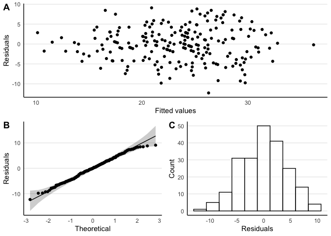<!-- -->

Multicollinearity statistics.

| Term                |      VIF | VIF_CI_high | SE_factor | Tolerance | Tolerance_CI_low | Tolerance_CI_high | Label      |
|:--------------------|---------:|------------:|----------:|----------:|-----------------:|------------------:|:-----------|
| Age                 | 2.464729 |    2.981808 |  1.569946 | 0.4057241 |        0.3353670 |         0.4801776 | Low (\< 5) |
| Gender              | 1.375806 |    1.635465 |  1.172948 | 0.7268465 |        0.6114471 |         0.8181649 | Low (\< 5) |
| Ethnicity           | 1.686654 |    2.013693 |  1.298712 | 0.5928898 |        0.4966001 |         0.6825357 | Low (\< 5) |
| Relationship        | 3.372557 |    4.116987 |  1.836452 | 0.2965109 |        0.2428961 |         0.3563894 | Low (\< 5) |
| Employment          | 3.391392 |    4.140556 |  1.841573 | 0.2948642 |        0.2415135 |         0.3544921 | Low (\< 5) |
| Pain.loc            | 3.114230 |    3.793773 |  1.764718 | 0.3211066 |        0.2635898 |         0.3846190 | Low (\< 5) |
| Pain.duration       | 1.221142 |    1.461196 |  1.105053 | 0.8189057 |        0.6843708 |         0.9041292 | Low (\< 5) |
| Beliefs.organic     | 1.479814 |    1.760271 |  1.216476 | 0.6757608 |        0.5680943 |         0.7675690 | Low (\< 5) |
| Beliefs.psych       | 1.183404 |    1.424780 |  1.087844 | 0.8450201 |        0.7018627 |         0.9266237 | Low (\< 5) |
| Daily.opioid.intake | 1.342727 |    1.596548 |  1.158761 | 0.7447532 |        0.6263512 |         0.8354903 | Low (\< 5) |
| Mental.health       | 1.376704 |    1.636527 |  1.173330 | 0.7263726 |        0.6110499 |         0.8177032 | Low (\< 5) |
| Pain.intensity      | 1.985594 |    2.384353 |  1.409111 | 0.5036276 |        0.4194010 |         0.5876487 | Low (\< 5) |
| Disability          | 2.329004 |    2.812354 |  1.526107 | 0.4293681 |        0.3555740 |         0.5064414 | Low (\< 5) |
| Support.oss3        | 1.298275 |    1.545252 |  1.139419 | 0.7702527 |        0.6471435 |         0.8597205 | Low (\< 5) |

#### Fit Statistics

|     | Parameter |   Fit |
|:----|:----------|------:|
| 33  |           |       |
| 34  | R2        | 0.562 |
| 35  | R2 (adj.) | 0.487 |
| 36  | Sigma     | 4.610 |

### Step II: Explaining depression with stigma

#### Model Setup

``` r
Model.stageII.dep.stepII <- lm(Depression.phq9 ~ Age + Gender + Ethnicity +
                                 Relationship + Employment +
                                 Pain.loc + Pain.duration +
                                 Beliefs.organic + Beliefs.psych +
                                 Daily.opioid.intake + Mental.health +
                                 Pain.intensity + Disability + Support.oss3 +
                                 Stigma.total,
                               data = Datasource)
```

#### Diagnostics

Residuals plot.

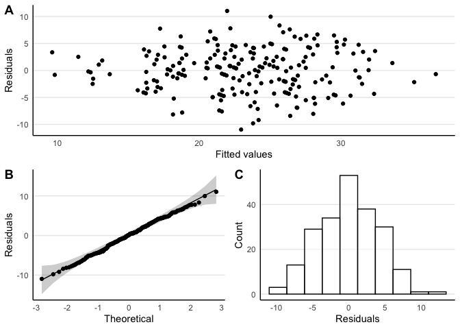<!-- -->

Multicollinearity statistics.

| Term                |      VIF | VIF_CI_high | SE_factor | Tolerance | Tolerance_CI_low | Tolerance_CI_high | Label      |
|:--------------------|---------:|------------:|----------:|----------:|-----------------:|------------------:|:-----------|
| Age                 | 2.488632 |    3.008300 |  1.577540 | 0.4018271 |        0.3324137 |         0.4754131 | Low (\< 5) |
| Gender              | 1.401656 |    1.664322 |  1.183915 | 0.7134418 |        0.6008451 |         0.8046054 | Low (\< 5) |
| Ethnicity           | 1.723900 |    2.057451 |  1.312974 | 0.5800801 |        0.4860384 |         0.6686455 | Low (\< 5) |
| Relationship        | 3.569352 |    4.358243 |  1.889273 | 0.2801629 |        0.2294503 |         0.3371794 | Low (\< 5) |
| Employment          | 3.575388 |    4.365788 |  1.890870 | 0.2796899 |        0.2290537 |         0.3366323 | Low (\< 5) |
| Pain.loc            | 3.249759 |    3.958800 |  1.802709 | 0.3077151 |        0.2526018 |         0.3689177 | Low (\< 5) |
| Pain.duration       | 1.228376 |    1.466789 |  1.108321 | 0.8140828 |        0.6817615 |         0.8994965 | Low (\< 5) |
| Beliefs.organic     | 1.494741 |    1.776431 |  1.222596 | 0.6690121 |        0.5629264 |         0.7603124 | Low (\< 5) |
| Beliefs.psych       | 1.208752 |    1.446823 |  1.099433 | 0.8272993 |        0.6911695 |         0.9111388 | Low (\< 5) |
| Daily.opioid.intake | 1.358541 |    1.613247 |  1.165565 | 0.7360836 |        0.6198677 |         0.8267026 | Low (\< 5) |
| Mental.health       | 1.396390 |    1.658048 |  1.181690 | 0.7161322 |        0.6031190 |         0.8072492 | Low (\< 5) |
| Pain.intensity      | 1.986670 |    2.383080 |  1.409493 | 0.5033548 |        0.4196251 |         0.5868967 | Low (\< 5) |
| Disability          | 2.823293 |    3.426031 |  1.680266 | 0.3541963 |        0.2918830 |         0.4218870 | Low (\< 5) |
| Support.oss3        | 1.420454 |    1.686792 |  1.191828 | 0.7040003 |        0.5928413 |         0.7952907 | Low (\< 5) |
| Stigma.total        | 2.205680 |    2.655565 |  1.485153 | 0.4533750 |        0.3765677 |         0.5324682 | Low (\< 5) |

#### Model Summary

| Parameter                         | Coefficient | CI (low) | CI (high) | Std. Coefficient |   Fit |
|:----------------------------------|------------:|---------:|----------:|-----------------:|------:|
| (Intercept)                       |       5.730 |   -2.675 |    14.135 |           -0.254 |       |
| Age                               |      -0.063 |   -0.130 |     0.004 |           -0.137 |       |
| Gender \[Female\]                 |      -0.988 |   -3.447 |     1.472 |           -0.153 |       |
| Gender \[Other\]                  |       2.839 |   -4.046 |     9.724 |            0.441 |       |
| Ethnicity \[Māori\]               |       1.165 |   -1.166 |     3.497 |            0.181 |       |
| Ethnicity \[Pacific\]             |       0.358 |   -4.617 |     5.334 |            0.056 |       |
| Ethnicity \[Asian\]               |       1.753 |   -2.967 |     6.473 |            0.272 |       |
| Relationship \[In a relation\]    |       1.230 |   -1.013 |     3.474 |            0.191 |       |
| Relationship \[Married/De facto\] |       0.852 |   -0.969 |     2.673 |            0.132 |       |
| Relationship \[Divorced/sep.\]    |      -0.957 |   -3.617 |     1.703 |           -0.149 |       |
| Relationship \[Widowed\]          |       3.747 |   -1.205 |     8.699 |            0.582 |       |
| Employment \[Unemployed/benefit\] |       1.511 |   -0.186 |     3.208 |            0.235 |       |
| Employment \[Work at home\]       |      -0.968 |   -3.998 |     2.061 |           -0.150 |       |
| Employment \[Retired\]            |       1.314 |   -1.758 |     4.386 |            0.204 |       |
| Employment \[Student\]            |      -1.768 |   -4.659 |     1.122 |           -0.275 |       |
| Employment \[Other\]              |      -0.981 |   -4.949 |     2.986 |           -0.152 |       |
| Pain loc \[Neck/back\]            |       2.266 |   -0.387 |     4.919 |            0.352 |       |
| Pain loc \[Upper limb\]           |       1.044 |   -1.808 |     3.896 |            0.162 |       |
| Pain loc \[Chest\]                |       1.926 |   -2.711 |     6.563 |            0.299 |       |
| Pain loc \[Abdomen/pelvis\]       |       2.663 |   -0.173 |     5.499 |            0.414 |       |
| Pain loc \[Hips/buttocks\]        |       1.708 |   -1.293 |     4.709 |            0.265 |       |
| Pain loc \[Lower limb\]           |       2.550 |   -0.361 |     5.462 |            0.396 |       |
| Pain loc \[Other/widepread\]      |       2.006 |   -1.376 |     5.387 |            0.312 |       |
| Pain loc \[Missing\]              |       1.594 |   -4.457 |     7.645 |            0.248 |       |
| Pain duration                     |      -0.633 |   -1.569 |     0.304 |           -0.070 |       |
| Beliefs organic                   |      -0.025 |   -0.146 |     0.097 |           -0.023 |       |
| Beliefs psych                     |       0.149 |   -0.019 |     0.317 |            0.090 |       |
| Daily opioid intake               |      -0.171 |   -0.818 |     0.476 |           -0.029 |       |
| Mental health \[No diagnosis\]    |      -1.977 |   -3.544 |    -0.411 |           -0.307 |       |
| Pain intensity                    |       0.388 |   -0.148 |     0.923 |            0.095 |       |
| Disability                        |       1.104 |    0.600 |     1.609 |            0.341 |       |
| Support oss3                      |      -0.057 |   -0.351 |     0.238 |           -0.021 |       |
| Stigma total                      |       3.917 |    2.082 |     5.752 |            0.294 |       |
|                                   |             |          |           |                  |       |
| R2                                |             |          |           |                  | 0.601 |
| R2 (adj.)                         |             |          |           |                  | 0.531 |
| Sigma                             |             |          |           |                  | 4.411 |

### Hypothesis Tests

    Anova Table (Type II tests)

    Response: Depression.phq9
                        Sum Sq  Df F value    Pr(>F)    
    Age                   66.1   1  3.3975   0.06694 .  
    Gender                36.2   2  0.9298   0.39653    
    Ethnicity             28.4   3  0.4869   0.69177    
    Relationship          97.3   4  1.2497   0.29162    
    Employment           132.9   5  1.3659   0.23922    
    Pain.loc             106.7   8  0.6856   0.70386    
    Pain.duration         34.6   1  1.7768   0.18422    
    Beliefs.organic        3.2   1  0.1625   0.68732    
    Beliefs.psych         59.3   1  3.0492   0.08248 .  
    Daily.opioid.intake    5.3   1  0.2727   0.60214    
    Mental.health        120.7   1  6.2028   0.01366 *  
    Pain.intensity        39.7   1  2.0381   0.15514    
    Disability           362.7   1 18.6392 2.604e-05 ***
    Support.oss3           2.8   1  0.1447   0.70414    
    Stigma.total         345.1   1 17.7389 3.999e-05 ***
    Residuals           3502.2 180                      
    ---
    Signif. codes:  0 '***' 0.001 '**' 0.01 '*' 0.05 '.' 0.1 ' ' 1

## Support

### Step I: Support and demographic/clinical variables

#### Model Setup

``` r
Model.stageII.sup.stepI <- lm(Support.oss3 ~ Age + Gender + Ethnicity +
                                Relationship + Employment +
                                Pain.loc + Pain.duration +
                                Beliefs.organic + Beliefs.psych +
                                Daily.opioid.intake + Mental.health +
                                Pain.intensity + Disability + Depression.phq9,
                              data = Datasource)
```

#### Diagnostics

Residuals plot.

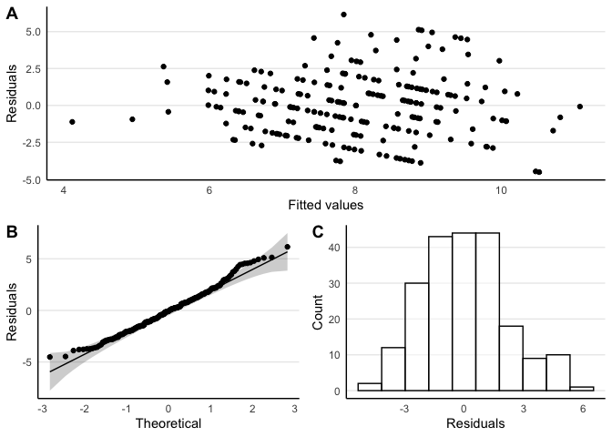<!-- -->

Multicollinearity statistics.

| Term                |      VIF | VIF_CI_high | SE_factor | Tolerance | Tolerance_CI_low | Tolerance_CI_high | Label      |
|:--------------------|---------:|------------:|----------:|----------:|-----------------:|------------------:|:-----------|
| Age                 | 2.523941 |    3.055768 |  1.588692 | 0.3962057 |        0.3272500 |         0.4695501 | Low (\< 5) |
| Gender              | 1.399734 |    1.663900 |  1.183104 | 0.7144215 |        0.6009978 |         0.8060097 | Low (\< 5) |
| Ethnicity           | 1.677963 |    2.002971 |  1.295362 | 0.5959605 |        0.4992583 |         0.6857427 | Low (\< 5) |
| Relationship        | 3.461084 |    4.227770 |  1.860399 | 0.2889268 |        0.2365313 |         0.3476438 | Low (\< 5) |
| Employment          | 3.482213 |    4.254213 |  1.866069 | 0.2871737 |        0.2350611 |         0.3456195 | Low (\< 5) |
| Pain.loc            | 3.037080 |    3.697266 |  1.742722 | 0.3292636 |        0.2704701 |         0.3939361 | Low (\< 5) |
| Pain.duration       | 1.221985 |    1.462060 |  1.105434 | 0.8183406 |        0.6839667 |         0.9036303 | Low (\< 5) |
| Beliefs.organic     | 1.479691 |    1.760122 |  1.216425 | 0.6758170 |        0.5681424 |         0.7676256 | Low (\< 5) |
| Beliefs.psych       | 1.215728 |    1.455697 |  1.102601 | 0.8225522 |        0.6869563 |         0.9073369 | Low (\< 5) |
| Daily.opioid.intake | 1.335938 |    1.588631 |  1.155828 | 0.7485376 |        0.6294729 |         0.8391207 | Low (\< 5) |
| Mental.health       | 1.439863 |    1.711997 |  1.199943 | 0.6945107 |        0.5841133 |         0.7863232 | Low (\< 5) |
| Pain.intensity      | 2.003124 |    2.406163 |  1.415318 | 0.4992201 |        0.4155995 |         0.5828844 | Low (\< 5) |
| Disability          | 2.810258 |    3.413607 |  1.676383 | 0.3558392 |        0.2929452 |         0.4241362 | Low (\< 5) |
| Depression.phq9     | 2.251749 |    2.715959 |  1.500583 | 0.4440992 |        0.3681940 |         0.5227065 | Low (\< 5) |

#### Fit Statistics

|     | Parameter |   Fit |
|:----|:----------|------:|
| 33  |           |       |
| 34  | R2        | 0.241 |
| 35  | R2 (adj.) | 0.111 |
| 36  | Sigma     | 2.282 |

### Step II: Explaining support with stigma

#### Model Setup

``` r
Model.stageII.sup.stepII <- lm(Support.oss3 ~ Age + Gender + Ethnicity +
                                 Relationship + Employment +
                                 Pain.loc + Pain.duration +
                                 Beliefs.organic + Beliefs.psych +
                                 Daily.opioid.intake + Mental.health +
                                 Pain.intensity + Disability + Depression.phq9 +
                                 Stigma.total,
                               data = Datasource)
```

#### Diagnostics

Residuals plot.

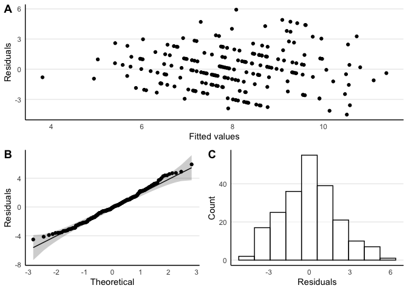<!-- -->

Multicollinearity statistics.

| Term                |      VIF | VIF_CI_high | SE_factor | Tolerance | Tolerance_CI_low | Tolerance_CI_high | Label      |
|:--------------------|---------:|------------:|----------:|----------:|-----------------:|------------------:|:-----------|
| Age                 | 2.533618 |    3.064426 |  1.591734 | 0.3946925 |        0.3263254 |         0.4674443 | Low (\< 5) |
| Gender              | 1.412414 |    1.677169 |  1.188450 | 0.7080077 |        0.5962429 |         0.7992511 | Low (\< 5) |
| Ethnicity           | 1.697443 |    2.024804 |  1.302860 | 0.5891215 |        0.4938750 |         0.6781255 | Low (\< 5) |
| Relationship        | 3.608561 |    4.407256 |  1.899621 | 0.2771188 |        0.2268985 |         0.3336572 | Low (\< 5) |
| Employment          | 3.627052 |    4.430371 |  1.904482 | 0.2757060 |        0.2257147 |         0.3320215 | Low (\< 5) |
| Pain.loc            | 3.116994 |    3.792903 |  1.765501 | 0.3208219 |        0.2636503 |         0.3839272 | Low (\< 5) |
| Pain.duration       | 1.222125 |    1.460326 |  1.105498 | 0.8182466 |        0.6847788 |         0.9031919 | Low (\< 5) |
| Beliefs.organic     | 1.494031 |    1.775569 |  1.222306 | 0.6693301 |        0.5631997 |         0.7606334 | Low (\< 5) |
| Beliefs.psych       | 1.229147 |    1.467591 |  1.108669 | 0.8135725 |        0.6813886 |         0.8990419 | Low (\< 5) |
| Daily.opioid.intake | 1.347210 |    1.599955 |  1.160694 | 0.7422749 |        0.6250175 |         0.8326815 | Low (\< 5) |
| Mental.health       | 1.444140 |    1.715242 |  1.201724 | 0.6924538 |        0.5830082 |         0.7838250 | Low (\< 5) |
| Pain.intensity      | 2.007919 |    2.409486 |  1.417010 | 0.4980281 |        0.4150264 |         0.5811387 | Low (\< 5) |
| Disability          | 3.110817 |    3.785186 |  1.763751 | 0.3214589 |        0.2641878 |         0.3846552 | Low (\< 5) |
| Depression.phq9     | 2.507367 |    3.031673 |  1.583467 | 0.3988248 |        0.3298509 |         0.4720618 | Low (\< 5) |
| Stigma.total        | 2.244812 |    2.704312 |  1.498270 | 0.4454716 |        0.3697799 |         0.5237802 | Low (\< 5) |

#### Model Summary

| Parameter                         | Coefficient | CI (low) | CI (high) | Std. Coefficient |   Fit |
|:----------------------------------|------------:|---------:|----------:|-----------------:|------:|
| (Intercept)                       |      14.120 |   10.449 |    17.790 |            0.022 |       |
| Age                               |       0.006 |   -0.027 |     0.040 |            0.037 |       |
| Gender \[Female\]                 |      -0.028 |   -1.258 |     1.202 |           -0.012 |       |
| Gender \[Other\]                  |       1.118 |   -2.322 |     4.558 |            0.462 |       |
| Ethnicity \[Māori\]               |      -0.299 |   -1.465 |     0.868 |           -0.124 |       |
| Ethnicity \[Pacific\]             |       1.438 |   -1.037 |     3.913 |            0.594 |       |
| Ethnicity \[Asian\]               |       1.964 |   -0.378 |     4.306 |            0.812 |       |
| Relationship \[In a relation\]    |      -0.457 |   -1.579 |     0.664 |           -0.189 |       |
| Relationship \[Married/De facto\] |       0.439 |   -0.470 |     1.348 |            0.182 |       |
| Relationship \[Divorced/sep.\]    |       0.140 |   -1.189 |     1.470 |            0.058 |       |
| Relationship \[Widowed\]          |       0.385 |   -2.102 |     2.872 |            0.159 |       |
| Employment \[Unemployed/benefit\] |      -0.682 |   -1.531 |     0.167 |           -0.282 |       |
| Employment \[Work at home\]       |      -0.394 |   -1.907 |     1.119 |           -0.163 |       |
| Employment \[Retired\]            |      -0.589 |   -2.124 |     0.945 |           -0.244 |       |
| Employment \[Student\]            |      -0.979 |   -2.420 |     0.463 |           -0.404 |       |
| Employment \[Other\]              |      -0.878 |   -2.856 |     1.099 |           -0.363 |       |
| Pain loc \[Neck/back\]            |       0.137 |   -1.198 |     1.472 |            0.057 |       |
| Pain loc \[Upper limb\]           |       0.281 |   -1.145 |     1.706 |            0.116 |       |
| Pain loc \[Chest\]                |      -1.688 |   -3.994 |     0.618 |           -0.698 |       |
| Pain loc \[Abdomen/pelvis\]       |      -0.471 |   -1.898 |     0.957 |           -0.195 |       |
| Pain loc \[Hips/buttocks\]        |       0.067 |   -1.436 |     1.571 |            0.028 |       |
| Pain loc \[Lower limb\]           |       0.637 |   -0.825 |     2.100 |            0.263 |       |
| Pain loc \[Other/widepread\]      |       0.412 |   -1.282 |     2.105 |            0.170 |       |
| Pain loc \[Missing\]              |       3.347 |    0.364 |     6.330 |            1.383 |       |
| Pain duration                     |      -0.389 |   -0.855 |     0.078 |           -0.114 |       |
| Beliefs organic                   |       0.015 |   -0.045 |     0.076 |            0.038 |       |
| Beliefs psych                     |      -0.005 |   -0.089 |     0.080 |           -0.008 |       |
| Daily opioid intake               |       0.218 |   -0.104 |     0.540 |            0.097 |       |
| Mental health \[No diagnosis\]    |      -0.087 |   -0.882 |     0.709 |           -0.036 |       |
| Pain intensity                    |      -0.046 |   -0.314 |     0.223 |           -0.030 |       |
| Disability                        |      -0.071 |   -0.335 |     0.194 |           -0.058 |       |
| Depression phq9                   |      -0.014 |   -0.088 |     0.059 |           -0.038 |       |
| Stigma total                      |      -1.771 |   -2.695 |    -0.847 |           -0.354 |       |
|                                   |             |          |           |                  |       |
| R2                                |             |          |           |                  | 0.297 |
| R2 (adj.)                         |             |          |           |                  | 0.172 |
| Sigma                             |             |          |           |                  | 2.202 |

### Hypothesis Tests

    Anova Table (Type II tests)

    Response: Support.oss3
                        Sum Sq  Df F value    Pr(>F)    
    Age                   0.68   1  0.1411 0.7075976    
    Gender                2.30   2  0.2372 0.7890858    
    Ethnicity            20.80   3  1.4297 0.2356452    
    Relationship         14.50   4  0.7472 0.5610590    
    Employment           20.22   5  0.8337 0.5273360    
    Pain.loc             64.92   8  1.6732 0.1076448    
    Pain.duration        13.13   1  2.7066 0.1016800    
    Beliefs.organic       1.20   1  0.2482 0.6189793    
    Beliefs.psych         0.06   1  0.0120 0.9130059    
    Daily.opioid.intake   8.68   1  1.7890 0.1827308    
    Mental.health         0.22   1  0.0461 0.8302206    
    Pain.intensity        0.54   1  0.1117 0.7386034    
    Disability            1.36   1  0.2795 0.5976744    
    Depression.phq9       0.70   1  0.1447 0.7041442    
    Stigma.total         69.31   1 14.2919 0.0002128 ***
    Residuals           872.96 180                      
    ---
    Signif. codes:  0 '***' 0.001 '**' 0.01 '*' 0.05 '.' 0.1 ' ' 1

# Exploratory Path Analysis

## Model Setup

``` r
Model <- '
Stigma            ~ Unemployment + Daily.opioid.intake + Mental.health + Beliefs.organic
Social.support    ~ Stigma
Disability        ~ Relationship + Beliefs.organic + Stigma + Pain.location + Pain.intensity
Depression        ~ Mental.health + Stigma + Disability
Depression        ~~ 0*Social.support
'
```

## Model Diagram

<!-- -->

## Model Summary

    lavaan 0.6-12 ended normally after 1 iterations

      Estimator                                         ML
      Optimization method                           NLMINB
      Number of model parameters                        17

      Number of observations                           215

    Model Test User Model:
                                                          
      Test statistic                                41.438
      Degrees of freedom                                21
      P-value (Chi-square)                           0.005

    Model Test Baseline Model:

      Test statistic                               482.493
      Degrees of freedom                                34
      P-value                                        0.000

    User Model versus Baseline Model:

      Comparative Fit Index (CFI)                    0.954
      Tucker-Lewis Index (TLI)                       0.926

    Loglikelihood and Information Criteria:

      Loglikelihood user model (H0)              -1583.040
      Loglikelihood unrestricted model (H1)      -1562.321
                                                          
      Akaike (AIC)                                3200.079
      Bayesian (BIC)                              3257.380
      Sample-size adjusted Bayesian (BIC)         3203.510

    Root Mean Square Error of Approximation:

      RMSEA                                          0.067
      90 Percent confidence interval - lower         0.036
      90 Percent confidence interval - upper         0.097
      P-value RMSEA <= 0.05                          0.161

    Standardized Root Mean Square Residual:

      SRMR                                           0.051

    Parameter Estimates:

      Standard errors                             Standard
      Information                                 Expected
      Information saturated (h1) model          Structured

    Regressions:
                       Estimate  Std.Err  z-value  P(>|z|)   Std.lv  Std.all
      Stigma ~                                                              
        Unemployment      0.205    0.065    3.160    0.002    0.205    0.195
        Daily.opid.ntk    0.057    0.027    2.086    0.037    0.057    0.126
        Mental.health     0.284    0.065    4.378    0.000    0.284    0.264
        Beliefs.organc    0.022    0.005    4.585    0.000    0.022    0.274
      Social.support ~                                                      
        Stigma           -2.028    0.310   -6.540    0.000   -2.028   -0.407
      Disability ~                                                          
        Relationship     -0.650    0.184   -3.533    0.000   -0.650   -0.168
        Beliefs.organc    0.037    0.017    2.185    0.029    0.037    0.116
        Stigma            1.567    0.201    7.789    0.000    1.567    0.393
        Pain.location    -0.328    0.186   -1.758    0.079   -0.328   -0.084
        Pain.intensity    0.527    0.062    8.477    0.000    0.527    0.429
      Depression ~                                                          
        Mental.health     2.649    0.705    3.758    0.000    2.649    0.188
        Stigma            5.226    0.746    7.005    0.000    5.226    0.399
        Disability        1.076    0.183    5.877    0.000    1.076    0.328

    Covariances:
                        Estimate  Std.Err  z-value  P(>|z|)   Std.lv  Std.all
     .Social.support ~~                                                      
       .Depression         0.000                               0.000    0.000

    Variances:
                       Estimate  Std.Err  z-value  P(>|z|)   Std.lv  Std.all
       .Stigma            0.175    0.017   10.368    0.000    0.175    0.744
       .Social.support    4.853    0.468   10.368    0.000    4.853    0.834
       .Disability        1.782    0.172   10.368    0.000    1.782    0.477
       .Depression       19.350    1.866   10.368    0.000   19.350    0.482

    R-Square:
                       Estimate
        Stigma            0.256
        Social.support    0.166
        Disability        0.523
        Depression        0.518

# References

<div id="refs" class="references csl-bib-body hanging-indent"
line-spacing="2">

<div id="ref-forSemPlot" class="csl-entry">

Epskamp, S. (2019). *semPlot: Path diagrams and visual analysis of
various SEM packages’ output*. Retrieved from
<https://CRAN.R-project.org/package=semPlot>

</div>

<div id="ref-forCar" class="csl-entry">

Fox, J., & Weisberg, S. (2019). *An R companion to applied regression*
(Third). Retrieved from
<https://socialsciences.mcmaster.ca/jfox/Books/Companion/>

</div>

<div id="ref-forReport" class="csl-entry">

Makowski, D., Ben-Shachar, M. S., Patil, I., & Lüdecke, D. (2021).
Automated results reporting as a practical tool to improve
reproducibility and methodological best practices adoption. *CRAN*.
Retrieved from <https://github.com/easystats/report>

</div>

<div id="ref-mcelreath2018statistical" class="csl-entry">

McElreath, R. (2018). *Statistical rethinking: A bayesian course with
examples in r and stan*. Chapman; Hall/CRC.

</div>

<div id="ref-forR" class="csl-entry">

R Core Team. (2021). *R: A language and environment for statistical
computing*. Retrieved from <https://www.R-project.org/>

</div>

<div id="ref-forLavaan" class="csl-entry">

Rosseel, Y. (2012). <span class="nocase">lavaan</span>: An R package for
structural equation modeling. *Journal of Statistical Software*,
*48*(2), 1–36. Retrieved from <https://www.jstatsoft.org/v48/i02/>

</div>

<div id="ref-van2012checklist" class="csl-entry">

Van de Schoot, R., Lugtig, P., & Hox, J. (2012). A checklist for testing
measurement invariance. *European Journal of Developmental Psychology*,
*9*(4), 486–492.

</div>

<div id="ref-forGGPlot" class="csl-entry">

Wickham, H. (2016). *ggplot2: Elegant graphics for data analysis*.
Retrieved from <https://ggplot2.tidyverse.org>

</div>

<div id="ref-forDplyr" class="csl-entry">

Wickham, H., François, R., Henry, L., & Müller, K. (2021). *Dplyr: A
grammar of data manipulation*. Retrieved from
<https://CRAN.R-project.org/package=dplyr>

</div>

</div>
